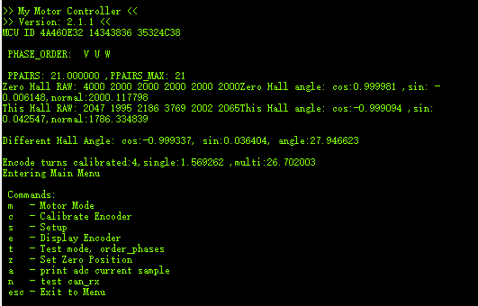

# 小米电机控制例程（移植f4）🚀🚀🚀

2025.05.03____勾槽的小米电机真tm难用

2025.06.26____什么傻逼电机啊，烧了我块C板，驱动器MCU的dcdc才支持24V，连着烧了两个驱动器，电机居然会因为自己的反向电动势导致断电之后会把自己烧掉？？？

2025.06.27____偶遇大佬解惑，更新使用手册，给后人留路，有问题请自己去想办法，不打算解决任何因为小米电机出现的问题。🚀🚀🚀

# 小米电机使用手册

by雷霆嘎巴老酸奶-2148142898

务必注意！！！检查xt30正负极和线的颜色是否正确，新的驱动板可能随机正反

刷固件，按照接线图里面接到stlink上，然后刷mi.hex那个固件，用STM32 ST-LINK Utility刷

接线图里面vssa是gnd

刷好固件后，串口连接到电脑，先打开串口，再给电机上电，上电后会显示如下界面

字符串发送c，校准电机，此时电机会轻微旋转，用于线性化磁编

结束后，进入设置界面，先改减速比，改成9，然后再改 扭矩常数0.0889

然后限制电机电流，把电流限制改到20

电机发送id和接收id自定义

mit协议自行探索，但需要注意，此电机只能使用扭矩，不能通过mit协议直接给位置或者速度，非常容易烧驱动器，同时在电机失控高速旋转的时候，请直接拔掉电机自身的xt30，将电机从整台车的供电电路上分离，不要关电源！！！不要直接关电源！！！不要直接关电源！！！关电源会因为电机具有惯性，在断电但还未停止的时候电机会有反向电动势，会将供电口的电压抬高，导致控制电机的C板烧掉。

控制例程：[LTGBLSN/motor_mit_control](https://github.com/LTGBLSN/motor_mit_control)

项目主目录下，是C板的例程，但是我自行修改的其他人的例程，有一些不确定性，在购买目录下有一个基于F0（忘了，应该是）系列的控制历程，里面是其他人的例程，应该算是比较官方的，可以两个代码相互结合着看。

使用电机前，请先使能，然后再发送控制函数，不要闲的没事用mit协议自身闭环！老老实实度编码器然后在电机外部做位置闭环，一味的炫技只会烧掉供电线上的所有东西然后变成小丑。

代码不保证完全好使，开发需谨慎，驱动板烧了请当场销毁，剪断供电插头，并在线材和驱动板上标注此驱动板已烧毁，请勿随意使用，烧东西并不是什么值得庆祝的，理性的处理才是值得被欣赏的。

祝调试顺利。
